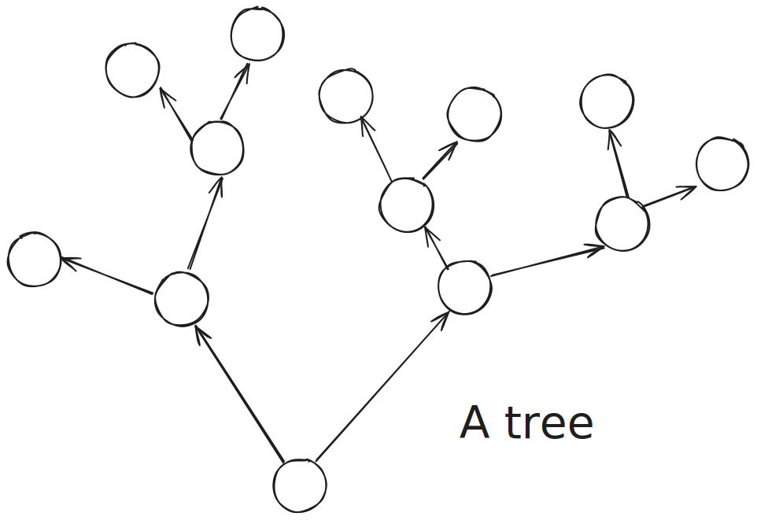
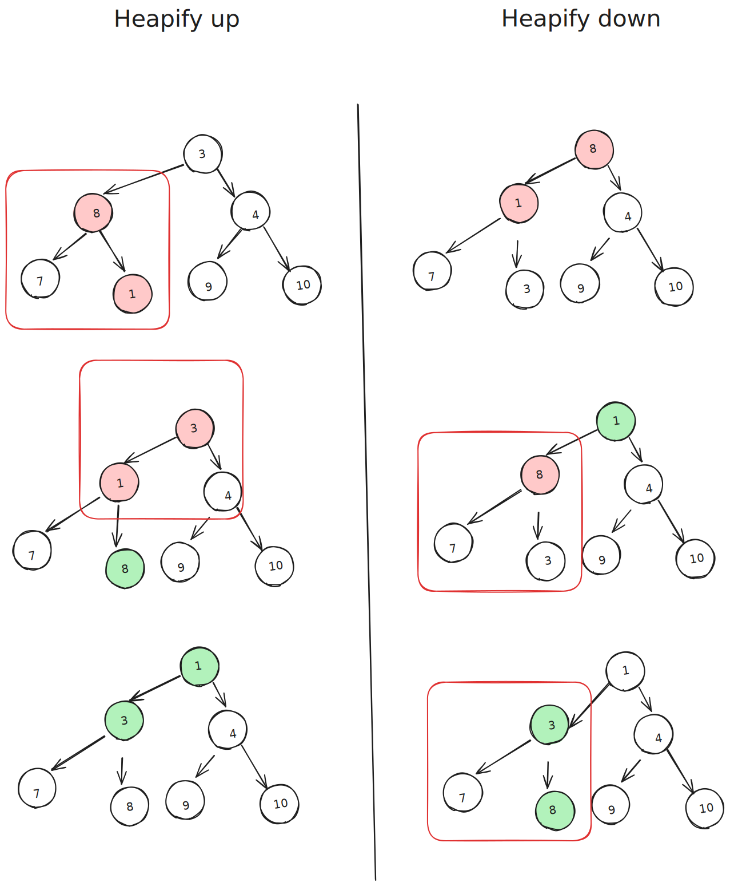

# Heap

Mukul-AI has launched an website that features stable diffusion image generation. It has various level of subscribers. The backed developer was asked to facilitate the pro users with a feature that allows them to generate the images with higher priority.
In an ordinary situation the developer could have solved this by using a **queue or array**. But the context requires handling the users based on their priority. **This requires sorting on each insertion and which is a very costly operation**.
So, the developer needs to use a dynamic data structure that can arrange the data in such a way that the highest priority element can be accessed fast and the insertion and deletion operations are also fast.

In these type of situations, usually some decision based trees are used. In this document we will discuss about a tree like data structure called Heap. However , if interested, the reader is encouraged to explore the other data structures like BST tree, AVL tree, Red-Black tree, etc.

Uprooting and numbering the nodes consecutively,

A pattern is observable:
$$node - \lceil{x/2} \rceil = parent node $$
$$ left = parent *2 - 1 $$
$$ right = parent *2 $$

This indicates that this structure can be put into a random accessible contiguous storage - using the numbers of the nodes as memory indexes. This forms the basis of the array representation of the heap. However to call this structure a heap, we need to induce some properties on this array. Based on the properties (obviously, we have been talking about complete trees - a tree where each node either has 0 or 2 nodes, level = log(n)+1, filled from left), we can have two types of heaps:

## Heap Property

Heap has two properties:

1. **Shape Property**: A heap is a complete binary tree. This means that all levels of the tree are fully filled except possibly for the last level, which is filled from left to right.
2. **Heap Property**: There is a relation between the parent and child nodes. This relation can be of any types, but the most common are:
   - **Max-Heap**: In a max-heap, the value of each node is greater than or equal to the values of its children. The highest value is at the root.
   - **Min-Heap**: In a min-heap, the value of each node is less than or equal to the values of its children. The lowest value is at the root.

**To perform the operations on the heap these properties must be maintained.** These properties ensures order and structure of the heap. Without these preconditons met these operations will not work. These properties allow inductive reasoning to be applied to the heap.

## Types of Heap

1. Max-Heap
   In a max-heap, the value of each node is greater than or equal to the values of its children. The highest value is at the root.
2. Min-Heap
   In a min-heap, the value of each node is less than or equal to the values of its children. The lowest value is at the root.

> We will limit our discussion to this array representation of heap.

> Heap needs preallocation of memory. The memory allocation is done in powers of 2. This is because the heap is a complete binary tree and the memory is allocated in a way that the tree is complete.

## Heapification

It's a recursive process of comparing the parent node with its children and swapping the parent with the largest (in max-heap) or smallest (in min-heap) child. This process is repeated until the parent node is greater (in max-heap) or smaller (in min-heap) than its children.

1. **Bottom-up approach**: Start from the last non-leaf node and heapify down each node.

2. **Top-down approach**: Start from the first node and heapify up each node.

### Max-Heapify

> Usually used after extraction

```cpp
void maxHeapify(vector<int>& heap, int i) {
    int size = heap.size();
    int largest = i;
    int left = 2 * i + 1;
    int right = 2 * i + 2;

    if (left < size && heap[left] > heap[largest]) largest = left;
    if (right < size && heap[right] > heap[largest]) largest = right;

    if (largest != i) {
        swap(heap[i], heap[largest]);
        maxHeapify(heap, largest);
    }
}

void buildMaxHeap(vector<int>& heap) {
    for (int i = heap.size() / 2 - 1; i >= 0; i--) {
        maxHeapify(heap, i);
    }
}
```

### Min-Heapify

> Usually used after insertion

```cpp
void minHeapify(vector<int>& heap, int i) {
    int size = heap.size();
    int smallest = i;
    int left = 2 * i + 1;
    int right = 2 * i + 2;

    if (left < size && heap[left] < heap[smallest]) smallest = left;
    if (right < size && heap[right] < heap[smallest]) smallest = right;

    if (smallest != i) {
        swap(heap[i], heap[smallest]);
        minHeapify(heap, smallest);
    }
}

void buildMinHeap(vector<int>& heap) {
    for (int i = heap.size() / 2 - 1; i >= 0; i--) {
        minHeapify(heap, i);
    }
}
```


Green means maintaining the heap property, red means requires heapification.

### Heapification of entire array


Well leaf nodes always maintain property, if we consider these root. However starting from top induces extra complexity, reader is encouraged to try starting from root to bottom heapification.

> The above approach is faster than insertion and heapification - reader may work on to find out why?

## Heap Operations

> Use our heap simulator.

### 1. Insertion

To insert a new element into a heap, add the element at the end of the heap and then heapify up to maintain the heap property.

#### Max-Heap Insertion

```cpp
void insertMaxHeap(vector<int>& heap, int value) {
    heap.push_back(value);
    int i = heap.size() - 1;
    while (i != 0 && heap[(i - 1) / 2] < heap[i]) {
        swap(heap[i], heap[(i - 1) / 2]);
        i = (i - 1) / 2;
    }
}
```

#### Min-Heap Insertion

```cpp
void insertMinHeap(vector<int>& heap, int value) {
    heap.push_back(value);
    int i = heap.size() - 1;
    while (i != 0 && heap[(i - 1) / 2] > heap[i]) {
        swap(heap[i], heap[(i - 1) / 2]);
        i = (i - 1) / 2;
    }
}
```

### 2. Peek

To get the root element (maximum in max-heap or minimum in min-heap) without removing it.

#### Peek

```cpp
int peekHeap(const vector<int>& heap) {
    if (heap.size() == 0) throw out_of_range("Heap is empty");
    return heap[0];
}
```

### 3. Extract-Max/Min

To remove and return the root element from the heap, replace it with the last element and heapify down.

#### Extract-Max

```cpp
int extractMax(vector<int>& heap) {
    if (heap.size() == 0) throw out_of_range("Heap is empty");
    int maxVal = heap[0];
    heap[0] = heap.back();
    heap.pop_back();
    heapify(heap, 0, true);
    return maxVal;
}
```

#### Extract-Min

```cpp
int extractMin(vector<int>& heap) {
    if (heap.size() == 0) throw out_of_range("Heap is empty");
    int minVal = heap[0];
    heap[0] = heap.back();
    heap.pop_back();
    heapify(heap, 0, false);
    return minVal;
}
```

### 4. Increase/Decrease-Key

To increase or decrease the value of a node, adjust the value and then heapify up or down as necessary to maintain the heap property.

#### Increase-Key

```cpp
void increaseKey(vector<int>& heap, int i, int newValue) {
    if (newValue < heap[i]) throw invalid_argument("New value is smaller than current value");
    heap[i] = newValue;
    while (i != 0 && heap[(i - 1) / 2] < heap[i]) { //down heapify
        swap(heap[i], heap[(i - 1) / 2]);
        i = (i - 1) / 2;
    }
}
```

#### Decrease-Key

> Min heap

```cpp
void decreaseKey(vector<int>& heap, int i, int newValue) {
    if (newValue > heap[i]) throw invalid_argument("New value is larger than current value");
    heap[i] = newValue;
    heapify(heap, i, false);
}
```

### 5. Delete-Key

To delete a specific node from the heap, replace it with the last element and then heapify up or down as necessary to maintain the heap property.

#### Delete-Key in Max-Heap

```cpp
void deleteKeyMaxHeap(vector<int>& heap, int i) {
    increaseKey(heap, i, INT_MAX);
    extractMax(heap);
}
```

#### Delete-Key in Min-Heap

```cpp
void deleteKeyMinHeap(vector<int>& heap, int i) {
    decreaseKey(heap, i, INT_MIN);
    extractMin(heap);
}
```

## Heap Sort

### Heap Sort

Heap sort is a comparison-based sorting algorithm that uses a binary heap data structure. It works by first building a max-heap from the input data, then repeatedly extracting the maximum element from the heap and rebuilding the heap until all elements are sorted.

#### Pseudo Code

```
function heapSort(array):
    buildMaxHeap(array)
    for i from length(array) - 1 to 1:
        swap(array[0], array[i])
        heapify(array, 0, i)
```

#### Complexity Analysis

- **Time Complexity**:
  - Building the max-heap: O(n)
  - Heapify operation: O(log n)
  - Extracting elements: O(n log n)
  - Overall: O(n log n)
- **Space Complexity**: O(1) (in-place sorting)
