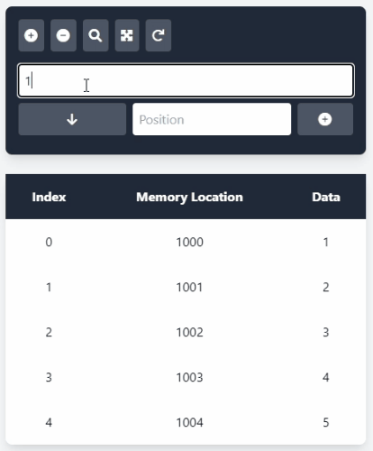
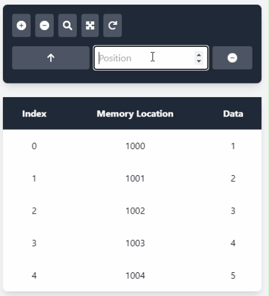
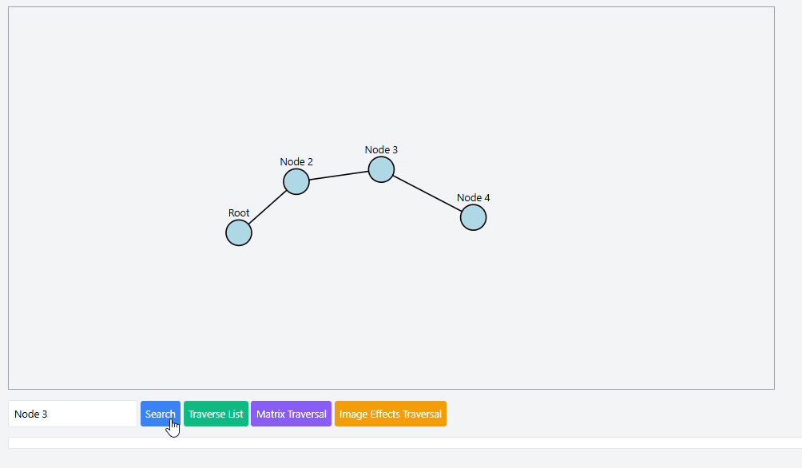
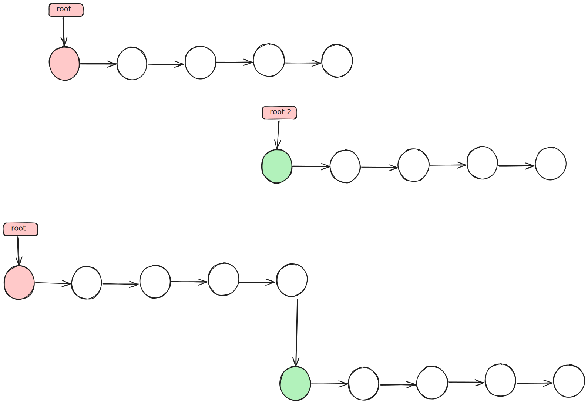
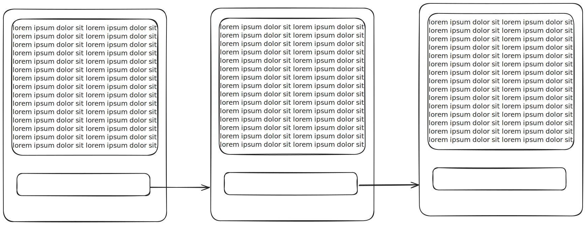
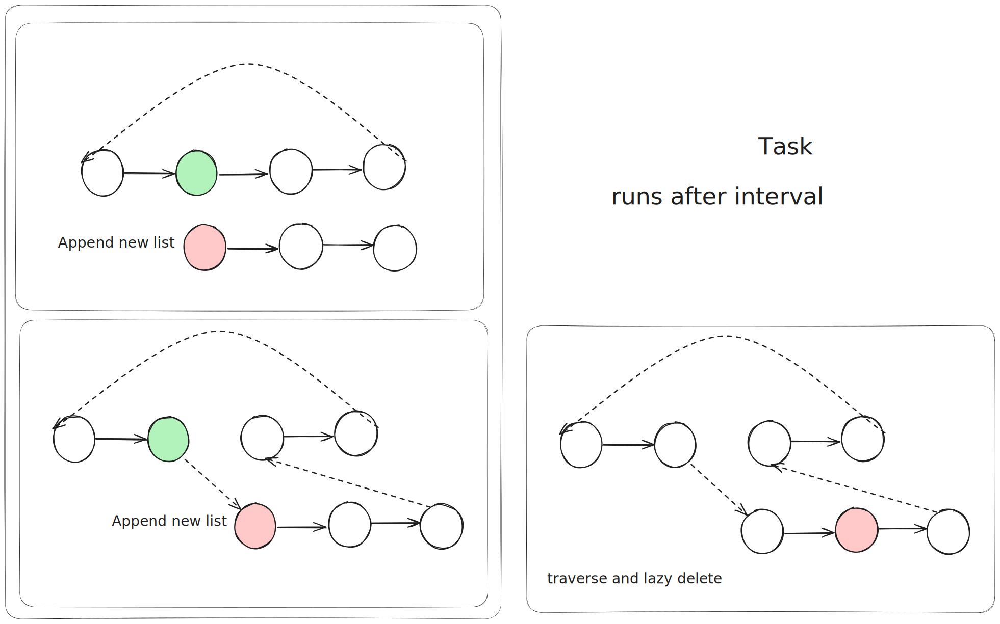
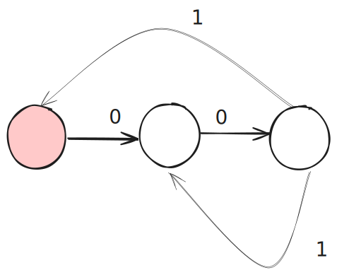
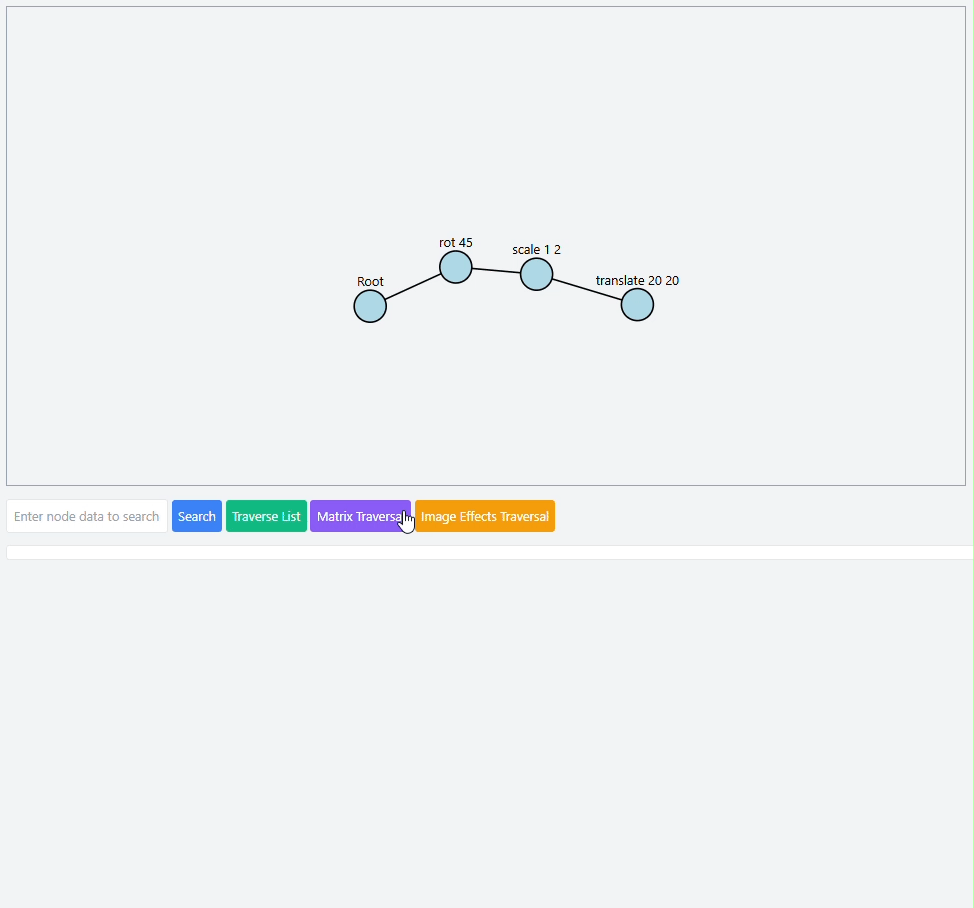
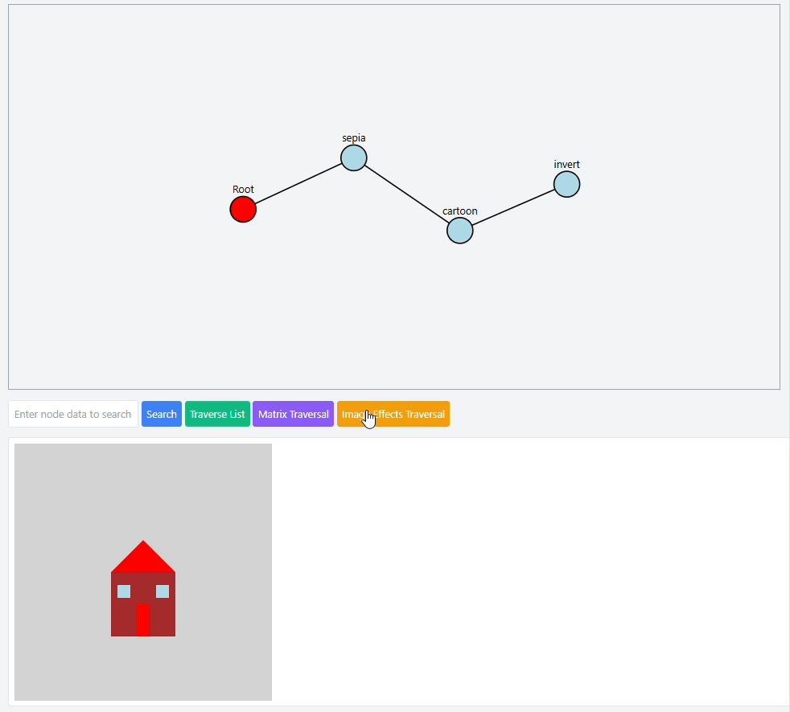

## Looking Back into Arrays

Array is indeed a great tool for iterative programming. However, would it have been enough, we needn't have to study the whole realm of Data Structures. 
Let's review array find out  where it lacks behind.

Array is a collection of **same sized data**, stored **consecutively** in computer memory. The highlighted property makes array very fast to access $O(1)$ . Let's watch some simulation which will give us insights on design limitations of array.

### Insertion at random position in array
As array elements are stored in consecutive order. Inserting a new one in $k$ position requires shifting all element from $k$ to $n$ by one position. 
 

In this example , reader may find some limitations, 
* The last element (in case it's a filled array) gets lost.
* A vast amount of data exchange is required
#### Removing from random position in array
The next elements are shifted up to  


#### The Array Simulator

## What is a linked list ?
Linked list a data structure* holding a data element and one or more references (addresses). It's a referential structure. 

It can be a struct/object holding at least two members data and reference. Conventionally such an object/struct is called a **Node**.  Here reference is usually the memory address of the next node.

```cpp
struct Node {
	type data;
	Node next = null; //next is the reference to next node
}
```

> Every byte stored in memory has a specific address which allows random access. Variables are names of memory addresses. Variables containing address of another variable are called pointers.


The initial node is called root. The last node is called tail. Usually these two node's addresses are available to the user.

```cpp
Node * root = new Node();
Node * tail;
root->next = new Node();
root->next->next = new Node();


// Or
Node * root = new Node();
Node * a = new Node();
Node * b = new Node();
root->next = a;
a->next = b;
```

It is visible that ,
* node *a* is not accessible from *b*
* *b* is also not directly accessible from  *root*
So in the mentioned example traversal is only possible from one direction. And only one advancement per iteration. 

**Question to the reader** : 
* Is it possible to traverse in both ways? If yes, can it be achieved with one reference only?
* Does this structure allow peeking into $i$<sup>th</sup> element in  single iteration?
* How to support different data types?

Array achieves $O(1)$ access time by keeping two constraints same size and consecutive memory. However in case of a linked list both size of element and memory location are not bound to any specified factors. 
### Traversing a Linked List

Traversing a linked list means visiting each node in the list exactly once. This can be done using a simple loop.

```cpp
Node* current = root;
while (current != nullptr) {
	// Process the current node
	current = current->next;
}
```
Searching
### Searching in a Linked List

Searching for a specific value in a linked list involves traversing the list and comparing each node's data with the target value.

```cpp
Node* search(Node* root, type target) {
   Node* current = root;
   while (current != nullptr) {
      if (current->data == target) {
         return current; // Target found
      }
      current = current->next;
   }
   return nullptr; // Target not found
}
```

In this example, the function `search` takes the root of the linked list and the target value as arguments. It returns a pointer to the node containing the target value, or `nullptr` if the target is not found.
 
**Task** : 
* Compare this with array traversal and array accessing
### Insertion
There can be 3 types of insertion
1. Before current root
   
3. In k<sup>th</sup> position
   
1. After tail
   
#### Codes
   ```cpp
   Node* insertAtRoot(Node* root, Node* &tail, type newData) {
      Node* newNode = new Node();
      newNode->data = newData;
      newNode->next = root;
      if (root == nullptr) {
         tail = newNode;
      }
      return newNode;
   }
   Node* insertAtPosition(Node* head, Node* &tail, type newData, int position) {
      if (position == 0) {
         return insertAtRoot(head, tail, newData);
      }
      Node* current = head;
      for (int i = 0; i < position - 1 && current != nullptr; ++i) {
         current = current->next;
      }
      if (current == nullptr) {
         return head; 
      }
      Node* newNode = new Node();
      newNode->data = newData;
      newNode->next = current->next;
      current->next = newNode;
      if (newNode->next == nullptr) {
         tail = newNode;
      }
      return head;
   }
   Node* insertAtTail(Node* root, Node* &tail, type newData) {
      Node* newNode = new Node();
      newNode->data = newData;
      newNode->next = nullptr;
      if (root == nullptr) {
         root = newNode;
         tail = newNode;
      } else {
         tail->next = newNode;
         tail = newNode;
      }
      return root;
   }
   ```
### Deletion
1. Current root
   
2. From k<sup>th</sup> position
   
3. The tail - self study
   Hint: modify mid to update tail
#### Codes
```cpp
Node* deleteFromRoot(Node* root, Node* &tail) {
   if (root == nullptr) {
      return nullptr;
   }
   Node* temp = root;
   root = root->next;
   if (root == nullptr) {
      tail = nullptr;
   }
   delete temp;
   return root;
}

Node* deleteFromPosition(Node* root, Node* &tail, int position) {
   if (root == nullptr || position < 0) {
      return root;
   }
   if (position == 0) {
      return deleteFromRoot(root, tail);
   }
   Node* current = root;
   for (int i = 0; i < position - 1 && current->next != nullptr; ++i) {
      current = current->next;
   }
   if (current->next == nullptr) {
      return root;
   }
   Node* temp = current->next;
   current->next = current->next->next;
   if (current->next == nullptr) {
      tail = current;
   }
   delete temp;
   return root;
}

Node* deleteFromTail(Node* root, Node* &tail) {
   if (root == nullptr || root->next == nullptr) {
      return deleteFromRoot(root, tail);
   }
   Node* current = root;
   while (current->next->next != nullptr) {
      current = current->next;
   }
   delete current->next;
   current->next = nullptr;
   tail = current;
   return root;
}
```
### Merging

Merging two sorted linked lists can be done efficiently if the tail of each list is known. The following code demonstrates how to merge two sorted linked lists into a single sorted linked list without using extra space.

```cpp
Node* mergeSortedLists(Node* list1, Node* list2) {
   if (list1 == nullptr) return list2;
   if (list2 == nullptr) return list1;

   Node* mergedHead = nullptr;
   if (list1->data <= list2->data) {
      mergedHead = list1;
      list1 = list1->next;
   } else {
      mergedHead = list2;
      list2 = list2->next;
   }

   Node* mergedTail = mergedHead;

   while (list1 != nullptr && list2 != nullptr) {
      if (list1->data <= list2->data) {
         mergedTail->next = list1;
         list1 = list1->next;
      } else {
         mergedTail->next = list2;
         list2 = list2->next;
      }
      mergedTail = mergedTail->next;
   }

   if (list1 != nullptr) {
      mergedTail->next = list1;
   } else {
      mergedTail->next = list2;
   }

   return mergedHead;
}
```

In this example, the function `mergeSortedLists` takes the heads of two sorted linked lists as arguments and returns the head of the merged sorted linked list.



Exercise : 
* You are given two sorted list, now join these in  a single list such that the new list is sorted and no extra space is used
* Try implementing merge sort (node swapped) and analyze its complexity
## Why do we need linked lists
Reader may wonder, some extra modifications in array may achieve 
## Use cases

1. Maximum insertion deletion at front/end. Does not require array copy like array.
2. Sequential traversal
3. Regular merging
4. High data size : reference size ratio
5. Where nodes are referenced multiple times, swapping in list does not affect the other processes as address remains same. (imagine having a large binary data which are referenced by multiple processes and one linked list any swapping in the linked list does not affect others. And any updates are momentarily done )
### As underlying data structures
Linked list is often used as core structure of various data structures like deque, stack and queues as it support $O(1)$ insertion and deletion at front and back (doubly). These structures are used for **undo/redo**,  **pagination** , **task scheduling** / **task queue management**, **dfs path**, **graph list** etc. 
### Large file saving
Imagine saving a size in a sequentially filled file system. To maximize performance chunk size of 4KB is used.

### Chunked Array
Arrays can be chunked. Instead of resizing a new next node can be added to improve cache locality without requiring copying. this can be used for ranged counting sort.
### Chained Tasks

Task : In this example, O(1) insertion at random positions are possible - find how
#### CRON Like

#### State Management


#### Effect list


## Limitations
* Very low cache hit rate
  After registers, cache is the fastest memory. As major number of elements of an array is loaded into cache, sequential access is way faster than linked list.
* Extra space taken
* Slow random access
* Insertion deletion can slower than array
### Binary Search on Linked list?
Yes possible with skiplist
## ToDo
- [ ] Linked list Merge - in simulator

large file saving and updating using chunks
Snake game -> move tail to head
